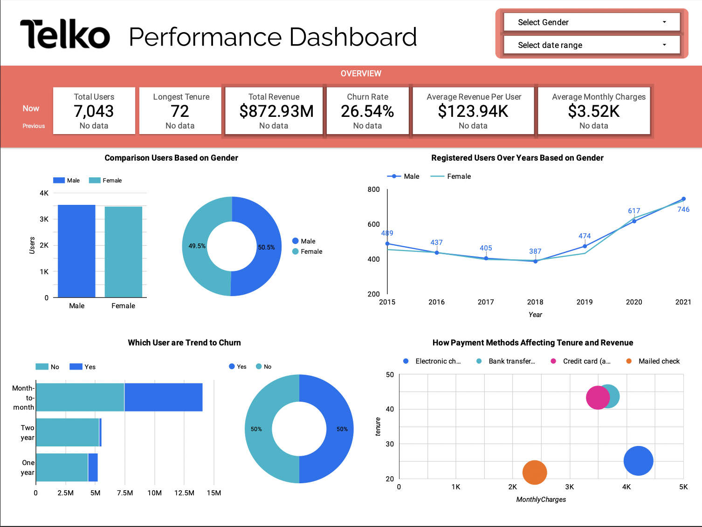
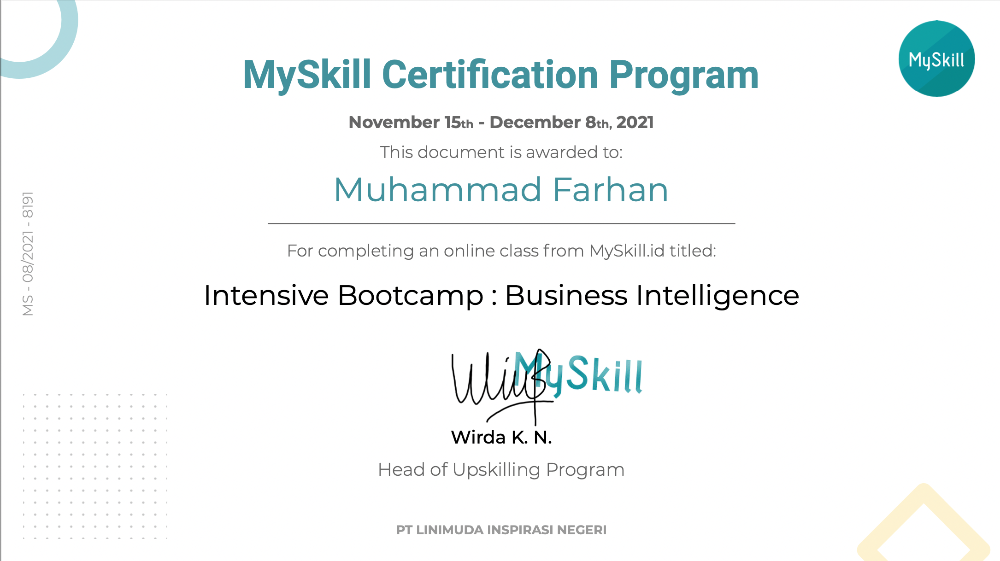

  

 

<h1 align="center">My Skill Intensive Bootcamp : Business Intelligence </h1>

  Repositori ini berisi tentang hasil pembelajaran saya selama mengikuti kegiatan <strong> Intensive Bootcamp : Business Intelligence </strong> dari <strong>My Skill</strong>.

Portofolio Dashboard

  

 

  Dashboard Diatas berisi informasi terkait kondisi performa keseluruhan dari perusahaan telekomunikasi tanpa di filter.

  

  

 

  Dashboard Diatas berisi informasi terkait kondisi performa keseluruhan dari perusahaan telekomunikasi dengan filter data hanya Pria.

  

  

 

  Dashboard Diatas berisi informasi terkait kondisi performa keseluruhan dari perusahaan telekomunikasi dengan filter data di tahun sebelumnya.

  
 

  <strong> nb : link untuk Google Data Studio diatas bisa diakses dengan klik link dibawah

   
  [Dashboard Google Data Studio](https://datastudio.google.com/reporting/4467de31-564e-411a-a800-ab062ba8fe73/page/LYhlC)
  

Certificate of Completion

 

  

 
  
 

